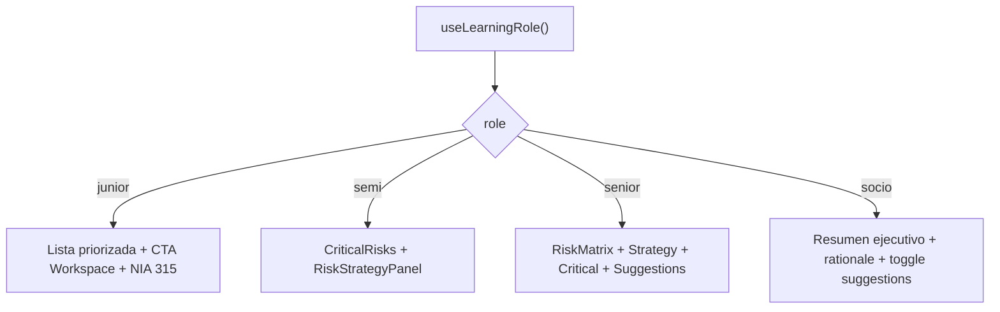
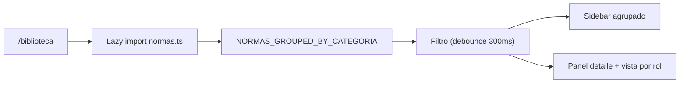

# Socio AI — Risk Engine por Rol, Login Redesign y Biblioteca

## 1) Risk Engine by Role
Archivo principal: `frontend/app/risk-engine/[clienteId]/page.tsx`

### Qué ve cada rol
- `junior`:
  - Lista priorizada de áreas críticas (ordenada por motor).
  - Acción guiada por nivel de riesgo y referencia `NIA 315`.
  - Resumen simple de estrategia (% sustantiva vs % control).
- `semi`:
  - Intro operativa + `CriticalRisks` + `RiskStrategyPanel`.
  - Sin matriz de calor técnica.
- `senior`:
  - Vista completa técnica: `RiskMatrix`, `RiskStrategyPanel`, `CriticalRisks`, `RiskProcedureSuggestions`.
- `socio`:
  - Resumen ejecutivo de 3 bloques (área top, estrategia, hallazgos abiertos).
  - `strategy.rationale` en tarjeta oscura.
  - Sugerencias de procedimientos ocultas por defecto con toggle.

### Datos esperados
- Fuente: hook `useRiskEngine(clienteId)`.
- Estructura crítica:
  - `criticalAreas[]`:
    - `area_id: string`
    - `area_nombre: string`
    - `score: number`
    - `nivel: "ALTO" | "MEDIO" | "BAJO" | "CRITICO"`
    - `hallazgos_abiertos: number`
    - `drivers: string[]`
  - `strategy`:
    - `approach: string`
    - `control_pct: number`
    - `substantive_pct: number`
    - `rationale: string`
    - `control_tests: string[]`
    - `substantive_tests: string[]`

### Referencias NIA
- En la vista junior se expone `NIA 315` directamente en cada tarjeta priorizada.
- Ubicación: bloque de render del rol `junior` en `page.tsx`.

### Performance aplicada
- Componentes pesados cargados con `dynamic(..., { ssr: false })`:
  - `RiskMatrix` (solo senior)
  - `RiskStrategyPanel`
  - `CriticalRisks`
  - `RiskProcedureSuggestions`
- Resultado: menor costo de render inicial para roles no técnicos.

### Testing en desarrollo
1. Inicia sesión y abre `/risk-engine/{clienteId}`.
2. Cambia el rol desde el selector del header (`useLearningRole`).
3. Valida:
   - Junior: ranking clickeable y sin matriz.
   - Semi: lista + estrategia, sin matriz.
   - Senior: layout completo.
   - Socio: resumen ejecutivo + toggle de sugerencias.

### Diagrama (flujo de vista por rol)

---

## 2) Biblioteca (/biblioteca)
Archivos:
- Página: `frontend/app/biblioteca/page.tsx`
- Datos SSOT: `frontend/data/normas.ts`
- Navegación: `frontend/components/navigation/Sidebar.tsx`

### Propósito
Ser una fuente única de consulta (SSOT) para NIAs y NIIF PYMES, con lectura adaptada por rol (junior/semi/senior/socio).

### Estructura de datos
Tipo: `NormaEntry` en `frontend/data/normas.ts`
- `codigo`
- `titulo`
- `categoria`
- `cuando_aplica`
- `objetivo`
- `requisitos_clave[]`
- `tags[]`
- `vista.junior | vista.semi | vista.senior | vista.socio`

### Cómo agregar nuevas normas
1. Agregar un objeto a `NORMAS` en `frontend/data/normas.ts`.
2. Completar todos los campos del tipo `NormaEntry`.
3. Verificar que `categoria` y `cuando_aplica` usen valores válidos.
4. Probar búsqueda por `codigo`, `titulo` y `tags`.

### Búsqueda
- Input con debounce de `300ms`.
- Filtra por:
  - `codigo`
  - `titulo`
  - `tags`

### Performance aplicada
- Carga diferida de dataset con `import("../../data/normas")` al abrir la ruta.
- Uso de `NORMAS_GROUPED_BY_CATEGORIA` precomputado en módulo para evitar recomputar agrupación base.

### Internlinks normativos
- Si en texto aparece `NIA 200` (u otra `NIA XXX`) se vuelve enlace interno.
- Acción: selecciona esa norma dentro de la misma pantalla.

### Mantenimiento recomendado
- Owner sugerido: líder técnico funcional de metodología + senior de calidad.
- Frecuencia sugerida: revisión trimestral y cuando cambien NIAs/NIIF.
- Validación: revisión cruzada técnica + funcional antes de merge.

### Diagrama (arquitectura de consulta)

---

## 3) Login Redesign
Archivo: `frontend/app/page.tsx`

### Qué cambió
- Solo UI/layout:
  - Split screen: panel de propuesta de valor (izquierda) + formulario (derecha).
  - Mobile: solo formulario, en pantalla completa y legible.
  - Focus visible y contraste mejorado para accesibilidad.

### Qué NO cambió
- Lógica de autenticación y flujo:
  - `handleSubmit`
  - llamadas a `buildApiUrl("/auth/login")`
  - manejo de `csrf_token`, `access_token`
  - `setSessionState` y redirect a `/clientes`

### Por qué esos 3 íconos
- `psychology`: criterio técnico NIA/NIIF asistido.
- `school`: aprendizaje guiado por rol.
- `route`: flujo de auditoría de punta a punta.

### Validación manual
1. Abrir `/` en desktop: verificar panel izquierdo + form derecho.
2. Abrir en móvil (DevTools): solo formulario, sin scroll innecesario.
3. Verificar labels, focus ring y contraste en inputs/botones.
4. Probar login exitoso y confirmar redirect a `/clientes`.

---

## Rutas y navegación relacionadas
- Ruta global agregada: `/biblioteca`
- Integración en sidebar:
  - `id: "biblioteca"`
  - `icon: "menu_book"`
  - `href: "/biblioteca"`
- Hint de header agregado:
  - `"biblioteca": "Consulta NIAs y NIIF PYMES resumidas por rol — criterio de referencia rápida."`
